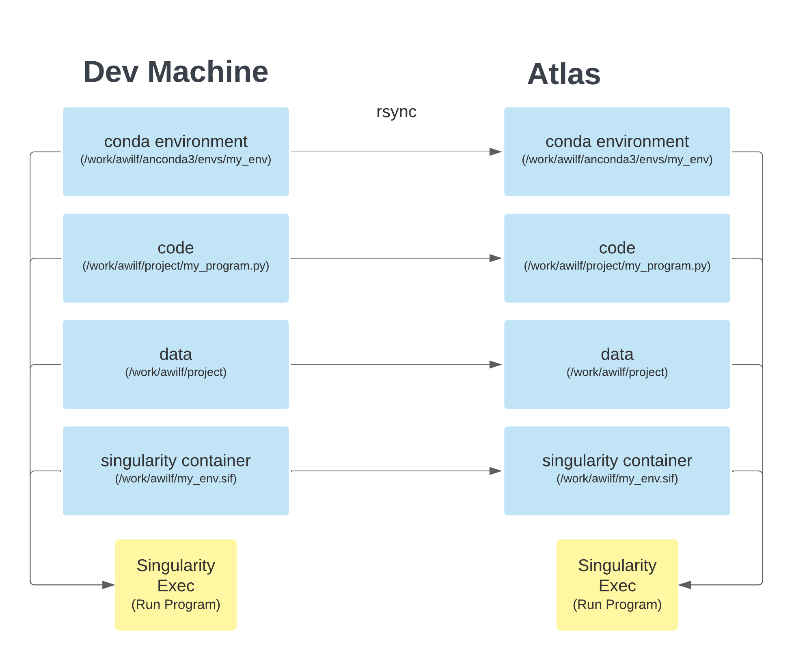

# Singularity Environments on Atlas

## TL;DR
For any conda environment on your development machine, seamlessly reproduce it on Atlas by doing the following
1. On your dev machine, make sure all packages are installed in `/work/username/anaconda3/my_env`
2. Get your program working in a conda environment on your dev machine, e.g. `conda activate my_env && python my_program.py`
3. Create a `singularity` container `my_env.sif` from the `container.def` file below; make sure you can run your program in it e.g. `singularity exec -B /work/awilf/ --nv my_env.sif python my_program.py`
4. Sync your dependencies, container, and code over to Atlas. Run the same command, make sure it works!

This process is illustrated below


## Motivation and Some High Level Notes
These are reproducible steps from scratch for getting an arbitrary conda environment from your personal machine working on Atlas (or any other cluster). Find and replace all instances of `awilf` and `taro` in this tutorial with your `andrewid` and `personal workstation name` (or `development workstation name`, if you're using a lab machine like `vulcan`).

A common approach to creating containers that can reproduce code between your personal machine and another system is this:
1. On your personal machine, create a container with the same OS as your personal machine
2. Install all the packages within it exactly as you installed them on your personal machine
3. Copy all the data and code to the container
4. Package it up, send it out, and run the code wherever

I have found problems with this approach. Step (1) works fine, but step (2) can run into unforseen difficulties that can be very hard to debug, especially with conda environments with complex dependencies or `.whl` files. Step (3) can be very costly in terms of space, and step (4) can take a long time because the container is large; this step also becomes increasingly expensive as the number of edits you make to the code grows. If you edit the code on your local machine then have to repackage and resend the container each time, it will be very inefficient.

Instead, the approach I take here is slightly different:
1. On your personal machine, install all packages into a `conda` environment in some path that exists on **both your remote and local machines**, e.g. `/work/awilf/anaconda3` and get the code working how you'd like
2. Create a container with the same OS as your personal machine
3. Activate the container, binding the `conda` env paths within it (so the container can access those files by reference). Create an environment script to initialize conda in this new shell from wherever conda is stored, `conda activate` the environment, and set any other environment variables you'd like. Then all you need to do to run the code on your personal machine is bind the paths referencing the code and data so you can see them (by reference) from within the container.
4. In essence, the container then just needs to store your OS and the steps for activating the environment. So next you'll package it up and send it, but this should be very lightweight and will likely only need to happen once (unless you change your conda environment name).
5. Send over your code, data, and *whole* conda folder (I do this for ease, as it only needs to happen once but you may be able to do this with just part by only sending e.g. `/work/awilf/anaconda3/envs/env_name` – though I haven't tested this). I like to make sure they're in the same absolute paths, so your code doesn't have to change - e.g. if you have your code in `/work/awilf/code.py` and your data in `/work/awilf/data`, then the runscript will be the same between your local and remote machines: e.g. `python /work/awilf/code.py /work/awilf/data` or `singularity exec -B /work/awilf/ --nv container.sif python /work/awilf/code.py /work/awilf/data`. This will be time consuming, but only needs to happen once at the beginning (not whenever you update). Whenever you update the data, you can send only what was updated with rsync which will not take long – e.g. `rsync -av /work/awilf/anaconda3 awilf@atlas:/work/awilf/`.
6. To run the code on Atlas, simply prepend a command that pulls the code from your local machine and then runs the command, e.g. `rsync -av --exclude data awilf@taro:/work/awilf/code_dir /work/awilf/ && singularity exec -B /work/awilf/ --nv container.sif /work/awilf/code.py`

To sum up, then.

1. *Once, at the beginning of the project*: you'll need to create the environment, get the code working on your local machine, create the container, send the container, conda env, data, and code over to atlas and get it running.
2. *Whenever you make updates*: if updates are just to the code, you can prepend a line that pulls code very quickly from your local machine. If updates are to data or environments, it might take longer but only has to happen once whenever you make the update.

In the rest of this tutorial, I will describe detailed steps for doing this.

## Requirements
- Your personal workstation or development machine will need to be linux or mac based because the paths have to match. If you need help accessing a linux workstation, let me know and I'll get you set up on one of the lab workstations for you to develop on.
- On both atlas and taro, install this anaconda in `/work/awilf/` (NOT `/home/awilf`, because atlas has limited space there).
```
wget https://repo.anaconda.com/archive/Anaconda3-2021.11-Linux-x86_64.sh
```
- You'll need to have `singularity3.x` installed. I use `3.6.3`; atlas uses `singularity3.8.7`. I haven't run into any compatibility issues so far.
- Once you've downloaded and installed conda, **create an environment that has all the dependencies you need**. Make sure you have a program that you can run successfully in your environment. e.g.
```bash
conda activate my_env
python my_program.py
```

## Install Packages
First we need to make sure all your packages are installed into the `/work/awilf/anaconda3` path. Sometimes pip installes into a cache dir in `/home`. This will fail for two reasons: on atlas there isn't a lot of space in `/home`, and because we're only going to sync the anaconda files. To test this, on `taro`: get rid of `~/.local`. Sometimes packages can be hiding here. We need all packages to be in `/work/awilf/anaconda3`. This will ablate that away and show you which packages you need to reinstall.
```
mv ~/.local/lib/python3.7 ~/.local/lib/python3.7_bak
```

For whatever program you have, run it in your environment. e.g.
```bash
conda activate my_env
python my_program.py
```

If this breaks, then find all the packages installed in .local, uninstall them, and reinstall them in anaconda e.g. for `pandas`
```
pip uninstall -y pandas && pip install --no-cache-dir pandas
```

Note: You can use `du -sh /home/awilf` to check how much space you're using. It should be almost none.

## Building the container
### Defining the Container
Create a file called `container.def`. Inside, initialize your container like this. The key part is to use the same OS and cuda as your local machine and to source `conda` and `activate` the right environment so you can reproduce your local conditions on Atlas. e.g. my OS is `ubuntu20.04` and I use `cuda:11.1.1` so that's the container I'll initialize from. All we need this container to do is activate the conda environment we're passing in **by reference**.

**container.def**
```
Bootstrap: docker
From: nvidia/cuda:11.1.1-cudnn8-devel-ubuntu20.04

%environment
. /work/awilf/anaconda3/etc/profile.d/conda.sh
conda activate my_env
```

### Creating the container
```
sudo singularity build my_env.sif container.def
```


## Sanity check: run using the container on local machine
You can replace the `python` line below with whatever tests you want to run to make sure the environment is correct. When you pass in `-B /work/awilf/` the singularity container now has access *by reference* to all subdirectories of `/work/awilf/`, which gives it access to your code & data.
```
singularity exec -B /work/awilf/ --nv my_env.sif \
python my_program.py
```

Or if you want unit tests:
```
singularity exec -B /work/awilf/ --nv my_env.sif \
python -c "import torch; print(torch.cuda.is_available(), torch.__version__); import torch_scatter; import torch_sparse; import torch_geometric"
```

## Get working on Atlas
This is the beautiful part. To get working on atlas, simply `rsync` over the environment file to atlas, sync over the dependencies
```
rsync -av /work/awilf/anaconda3/envs/env_name awilf@atlas:/work/awilf/anaconda3/envs
rsync -av /work/awilf/my_env.sif awilf@atlas:/work/awilf
rsync -av /work/awilf/my_progrma.py awilf@atlas:/work/awilf/
```

Then, on atlas, run the same program
```
singularity exec -B /work/awilf/ --nv my_env.sif python my_program.py
```
