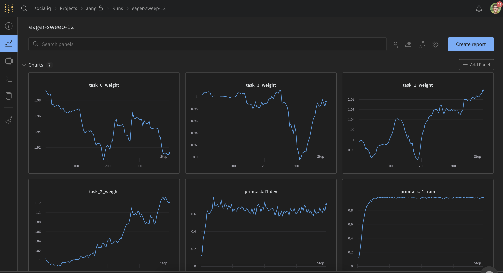
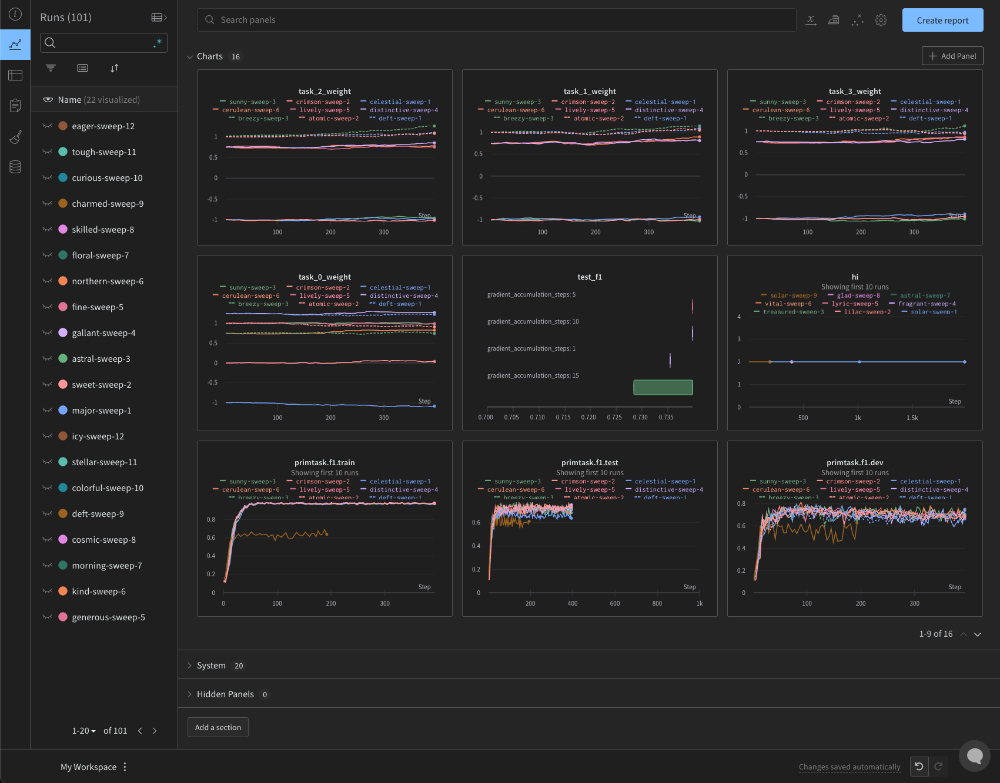
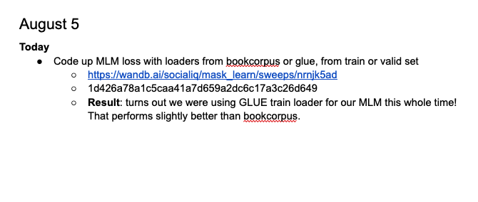
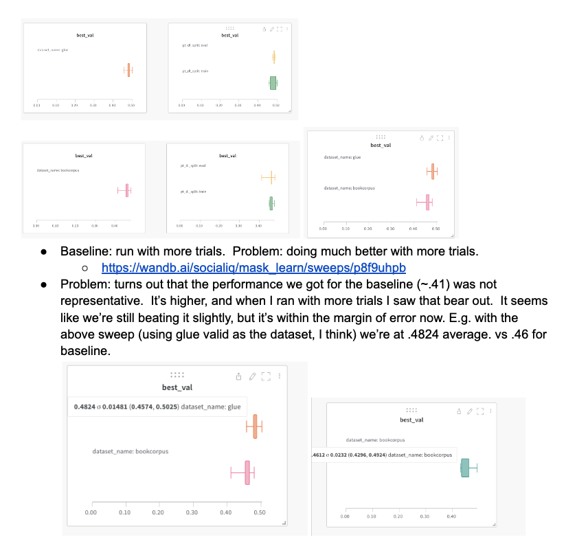

# Experimental Workflow

The goal of this tutorial is to introduce you to the way I manage my experiments.  It's important to mention: I think that as long as workflows accomplish some high level goals, they are highly personalizable.  So I would encourage you to carefully consider the goals and the pitfalls sections below, and to take my specific implementation with a healthy amount of skepticism.  At the end of this tutorial, I hope you understand the common problems with expermiental workflows, have learned a good starting place for how to manage your experiments, and have come up with lots of ideas for how you'd like to customize the workflow for yourself.

Note: if you'd like to skip the high level and go straight to my system, it's in "My Experimental Flow" below.

As motivation, here's an [example video](https://drive.google.com/file/d/1wcT3tpFMPAqScjwVNyajd1VKGLsYfjcd/view?usp=sharing) of what my workflow looks like for deploying experiments in real time.

## Goals of a Good Experimental Workflow
First, we should answer: "what is an experimental workflow?" I think of it as a _set of routines_ that define how I begin, develop, test, and consolidate my gains when doing research. I think a good experimental workflow should do four things well:
1. **Environments**: we would like to work out our environment and dependencies _once_ in a setting where we have full control (i.e. `sudo`), then be able to port this environment seamlessly over to any deployment setting we'd like (e.g. Atlas, TPU...etc).
2. **Experimental Reproducability**: we'd like to be able to easily revert back to previous versions and reproduce those results.
3. **Running Experiments with a Single Command**: oftentimes "running experiments" takes a lot of work, but it doesn't have to. What we have to do is (a) define the parameters that define our experiment, (b) provision the nodes we'd like to distribute across, (c) sync our code between each node, and (d) run the code on each node. This can all be automated, and is below.
4. **Collating and Visualizing Results from Experiments, Drawing Conclusions, Consolidating Gains**: we'd like to be able to quickly and easily collate the results from our experiments, no matter where they were run.  We will then want to construct visualizations about our results so we can draw conclusions.  Before we move on, we'd like to consolidate our gains by keeping a clear log of what we learned and how to rerun this experiment.

At a high level, I see a good experimental workflow as removing all the existential worries about research that might keep us up at night (e.g. "What if I can't reproduce the experiments I've already run? Did I forget to commit? Did I forget to push??", "Getting this working on the cluster is going to be a nightmare"). The goal is to have a set of procedures that we always follow so we can do great science and not have to worry about these kinds of questions. 

Also, building a solid experimental workflow allows us to scale the number of experiments we can perform without requiring more mental energy or reducing  losing confidence in our 

Also, by building solid foundations of how we approach experiments we can perform more experiments, faster, with less mental energy required and a reduced possibility for mistakes.

## Pitfalls
Why is it hard to create a good experimental workflow? I'll answer in each of the four categories we talked about above.

1. **Environments**: if you use conda, then you have to set it up on each system (your dev machine, Atlas, TPU).  It's always a pain, and sometimes it actually isn't possible – sometimes conda environments rely on packages that need to be `sudo` installed, which you won't be able to do on Atlas. If you use containers the traditional way (not the way I describe below), you have to set up your environment twice: once on your dev machine, then once on your dev machine within the environment (b/c it's annoying to develop within a container on vscode). Sometimes it's very annoying to install dependencies in a container b/c of how it interacts with the underlying machine. Also b/c of all the environments, the containers can get really big, and you have to retransfer the whole container between dev and deployment settings any time dependencies change.
2. **Experimental Reproducability**: if you don't keep a log, or your commit and reproducability system is not well structured, you may lose confidence in the reproducability of past experiments, meaning you'll need to rerun them.
3. **Running Experiments with a Single Command**: There are a few things you usually have to do to run an experiment (which I'll define here as one or multiple runs of a program where you're looking for differences in the output - e.g. performance).
        
    1. Define the parameters of the experiment: all the different things you'd like to test
    
    2. Sync the code from development to your deployment env
    
    3. Start up the different workers you want to distribute across

    A simple example of this would be: you create a bunch of different programs that write to different .json file outputs, you sync the code over to atlas using rsync, you start up a few workers using srun or sbatch with the different commands. The problem is, this is a lot for you to do by hand; it's easy to make mistakes, and it slows you down.  This should all be automated.

4. **Collating and Visualizing Results from Experiments, Drawing Conclusions, Consolidating Gains**: if you're writing your outputs to local files, usually you have to do a lot of this by hand, remembering where the output files were, writing matplotlib code to visualize the results of your experiments. It's exhausting, and easy to make mistakes. Also it can be hard if you're writing to the same files (locking issues).  This approach also doesn't work across different systems for a single run (e.g. you're running some of the workers on Atlas, some on dev machines, some on TPU at the same time). This last case isn't super common, but it happens. Ideally, would like a central server that we can write to easily so we don't have to store local files.  It would be best if this central server also gave us visualization tools.

## My Experimental Workflow
### High Level
I use...
* git & github to manage my commit history (and use .gitignore liberally to ignore all irrelevant files)
* wandb (and associated config files) for experimental reproducability, experiment creation and running, data collation and visualization
* vscode for coding and debugging remotely on my dev machine
* iterm + tmux for my terminal, so that I can close my computer and not have to worry about my programs finishing b/c my ssh session was ended
* Any time I will log into a server more than once, I use **ssh keys**. If you're logging in from your laptop (or any other machine), get your ssh public key from there and put it in the remote server at `~/.ssh/authorized_keys`. This way you'll never have to enter a password to `ssh` into or `rsync` to or from the remote server. VScode also piggybacks on this, so you can remotely code edit without passwords.
```bash
mkdir -p /home/<username>/.ssh/
bash -c 'echo \
"\
PASTE_SSH_PUBLIC_KEY_HERE\
"\
>> /home/<username>/.ssh/authorized_keys'
```
* I have two environments: my development machine and the deployment environment.  I write all my code and do all my testing on my development machine (called taro), then I deploy all my tests to the Atlas cluster. If you're unfamiliar with how slurm clusters work, here is an [introductory video explaining them](https://drive.google.com/file/d/1flMH3tAZKg4y9pwV8edbgsvu0DHvzmfn/view?usp=sharing), and here are the [rules for using the Atlas cluster](https://docs.google.com/document/d/16OQ6f4Azrl9kp7FXdCzBdzvvGDSaUJzCRBNbDTLPecs/edit?usp=sharing).

### Specifics
#### Setting up Environments
This is described in detail in [Atlas_Singularity.md](https://github.com/abwilf/tutorials/blob/main/Atlas_Singularity.md). The high level idea is: 
1. We set up our environment **once** on our dev machine using `conda`, where our [Anaconda](https://repo.anaconda.com/archive/Anaconda3-2021.11-Linux-x86_64.sh) is installed in `/work/andrewid` (e.g. `/work/awilf/anaconda3/envs`).  This can take a while to get to work.
2. Once we've gotten this to work, we create a singularity container (e.g. `sudo singularity build container.sif container.def`) with the same OS as the dev machine that accesses the anaconda environments _by reference_, essentially passing in a pointer to the conda env location from the outside and mounting it on the container's file system.  The goal here is that then the singularity container is, for all intents and purposes, the _exact same environment as the dev machine_.  e.g. you could then do something like this
```bash
singularity exec -B /work/awilf/ --nv container.sif \
python <my_command_here>
```
And it would be the _same_ as if you had done

```bash
python <my_command_here>
```

3. This doesn't help us on the dev machine, but then you can sync (1) the created container to any other setting (e.g. Atlas) that supports singularity and (2) the folder with your conda envs (e.g. `rsync -av /work/awilf/anaconda3/envs/my_env awilf@atlas:/work/awilf/anaconda3/envs`), and this command should work the _exact same_ in the deployment setting as it does in your dev setting. It's important to keep all the file paths the same between dev and deployment (e.g. `/work/awilf/anaconda3`) so you can do this.
```bash
singularity exec -B /work/awilf/ --nv container.sif \
python <my_command_here>
```

The benefits of this approach are that as long as you can get the environment working once on your dev machine, where you have full control, with only a few additional steps and no uncertainty, you can get it working on any machine very quickly.  Then, if you need to update your environments, you just `rsync` over the environment folder again, and you'll only need to update the parts that you've changed instead of retransmitting a full docker container containing all the files (many GB's usually). And this passing-by-reference approach also saves you from having to set up the environment within the docker/singularity container each time, which can be really annoying and not always work.

#### Developing
I use vscode to write my code remotely on my development environment. vscode remote code editing piggybacks on ssh, so once you set up your ssh key on the development server vscode will allow you to remote code edit with no passwords.  To do this, get your ssh public key from your local machine and add it to `/home/username/.ssh/authorized_keys`.  Then when you ssh you won't need a password. As a general rule, I try to never type passwords. If I am, it can be automated.

I use the debug feature of vscode while I'm developing.  I set breakpoints and use the debug console constantly to write little snippets of code and inspect objects.  As a rule, I believe you should not use print statements, and instead always use debuggers.  They save you a ton of time.

As another rule in developing, I believe every second I spend learning keyboard shortcuts pays me back in many more seconds saved of mouse usage and also in happiness :).  I try to never use my mouse while I'm developing.  My keyboard shortcuts are in `keyboard_shortcuts.json` if you'd like to use those as a vscode starting point. It's also worth investing in text editing shortcuts, e.g. multi-cursor (cmd+d) and code folding.

#### Deploying Experiments
##### TL;DR
Create experiment configs in `<experiment_name>.yml`.  Then run `wdb.py --c <experiment_name>.yml` to generate the sweep, use resulting command / sbatch to distribute all tests.

##### Single Run (Simple Version)
First we'll talk about deploying an experiment that tests only a single run.  As we'll see, the goal of the system is to generalize effortlessly to experiments with many runs, but we'll start with the basics for now.

The idea is that each of my programs should take some CLI arguments and do something.  To track my experiments I use wandb, which as we'll see fulfills all the requirements I listed above.  To use wandb it's very simple, just register with your andrew account (they give it to us for free!), then in your code you need to call three functions.

```python
# Once at the beginning
wandb.init(
    project=project_name, 
    entity=entity_name,
    config=config, # config is what you want it to track about the parameters of this run
    tags=[]
)

# ...

for epoch in training:
    # Whenever you want to log something, call it like this
    wandb.log({'loss': random()})

# At the end of the program, you usually want to log a single number instead of a series (e.g. best test acc)
wandb.summary['test_acc'] = 10
```

When you run this code, you'll see a beautiful page like this for this "run".


You can go to all the runs in your project and view, sort, filter, and otherwise mess with the visualizations to understand how your experiments are proceeding.  It's wonderful.


A note: it's bad practice to have multiple versions of code for different experiments; instead it's recommended to use argument flags so you can reproduce all your experiments using different arguments to the code, making the codebase cohesive and reproducible. I also control randomness through seeds so my experiments are perfectly reproducible.

But now you may be thinking: "this isn't really deployment! I ran this on my local machine, and this is only a single run. How can I make this more generalizable and solve the problems you raised above?" Good point, we'll solve that next.

##### Single Run (Generalizable Version)
Wandb has something called "sweeps", which are (for our purposes for the moment) equivalent to distributed grid searches. You specify all the arguments in a `config.yml` file, then wandb creates a `sweep` on its server, and when you run the command `wandb agent sweep/id/things` (this is given to you when you run sweep) on a computer, that computer becomes a "worker". The wandb server tells it which command to run and captures its outut for centralized logging on the server.  When the run is finished, each worker checks with the server and it tells it what to run next until all the runs in the sweep have been finished.  So to run a single command, e.g.
`python /work/awilf/<repo_name>/<command_file> --epoch 5 --cls_tokens 0 --factorized 0`

in this way, we'd specify a config file like this
```yml
program: /work/awilf/<repo_name>/<command_file>
method: grid
metric:
  goal: maximize
  name: dev_acc # or whatever the final performance metric is
parameters:
  epoch:
    value: 5
  cls_tokens:
    value: 0
  factorized:
    value: 0
```

then run

```bash
wandb sweep config.yml
```

then sync our code to the atlas server
```
rsync -av /work/awilf/repo_name awilf@atlas:/work/awilf
```

then create an sbatch file that executes the `wandb agent ...` line that comes out of the sweep command.
```
#!/bin/bash
#SBATCH -p gpu_highmem
#SBATCH --gres=gpu:1
#SBATCH --cpus-per-task=8
#SBATCH --mem 35GB 
#SBATCH --time 2-23:00
#SBATCH --mail-type=ALL
#SBATCH --mail-user=dummyblah123@gmail.com # TODO
#SBATCH --chdir=/work/awilf/<repo_name>
#SBATCH --output=/work/awilf/<repo_name>/logs/%j.out # TODO
#SBATCH --error=/work/awilf/<repo_name>/logs/%j.err # TODO

singularity exec -B /work/awilf/ --nv /work/awilf/<repo_name>/container.sif \
wandb agent ...
```

then submit the sbatch command to the atlas server
`sbatch my_sbatch.sbatch`

**This is a lot of work**, so I've automated it all in `wdb.py`. Just run `python wdb.py --c config.yml` and it will do all this for you: all you need to do is modify some of the paths and the `rsa` command which controls what you want to rsync to and from the deployment server. Check the documentation there for details.

So when you run `python wdb.py --c config.yml`, you'll get something like this:
```
## Processing Config base.yml ##
Create sweep with ID: nkltdcna
Sweep URL and Atlas Command:
sbatch /work/awilf/AANG/base.sbatch
singularity exec -B /work/awilf/ --nv /work/awilf/AANG/aang.sif wandb agent socialiq/AANG/nkltdcna
https://wandb.ai/socialiq/aang/sweeps/nkltdcna
```

The sbatch command is what you can run on the server (it's been synced over there for you with the `rsa` flag command), the `singularity exec` command is if you want to run it locally, and the wandb sweep is where you can visualize this run.

##### Many Runs (Generalizable Version)
The beauty of this system is: to run many different tests, just change your config file. The below will run four runs, one with `--epoch 5 --cls_tokens 0`, one with `--epoch 5 --cls_tokens 1`...etc.
```yml
program: /work/awilf/<repo_name>/<command_file>
method: grid
metric:
  goal: maximize
  name: dev_acc
parameters:
  epoch:
    values: 
    - 5
    - 10
  cls_tokens:
    values: 
    - 0
    - 1
  factorized:
    value: 0
```

Then you can run `python wdb.py --c config.yml` and with the resulting sbatch command, paste that as many times on Atlas as you'd like to distribute your tests.

##### Many Runs, Many Experiments
The `wdb.py` script also supports a little workaround I use to be able to run multiple different experiments from a single yaml where experiments may have some shared and some unshared hyparparameters defining their search. Check out the docstring at the top of `wdb.py` and the `composite.yml` files for details.

#### Collating and Visualizing Results, Drawing and Storing Conclusions
All your runs will be collated in wandb.  You can check out the dashboards and visualization tools to help you.  At the end of each experiment, I commit and store the commit hash in my log file (in google docs, so I can include images). e.g.




You can use the "tags" feature of wandb.init to help you filter your runs, as well.

### Some Minor Notes
These are more general aspects of workflow:
* I use [Alfred](https://www.alfredapp.com/) for my mac. I use the snippets (e.g. ;alexut -> import sys; sys.path.append('/work/awilf/utils/'); from alex_utils import *) and multiple clipboard features constantly.
* I use [Spectacle](https://www.spectacleapp.com/) for moving windows around between my monitor and my mac
* I use [sshfs](https://www.digitalocean.com/community/tutorials/how-to-use-sshfs-to-mount-remote-file-systems-over-ssh) to mount my dev machine on my mac so I can listen to audio files and watch videos from datasets.
* I use [sublime](https://www.sublimetext.com/) for managing my todo's and logging relevant commands.
* I use wandb sweeps described above to distribute all different kinds of jobs, not just experiments; e.g. distributing processing of videos in a dataset can be done with a config file such as the below.  This is "grid search" where each different element of the grid is a job you want to run. You don't care about logging anything, you just want it to run.
```yml
...
parameters:
    video_name:
    - video1
    - video2
    ...
```
* I haven't talked almost at all about managing code style.  If you're interested, this is a good resource: [goodresearch.dev](https://goodresearch.dev/).