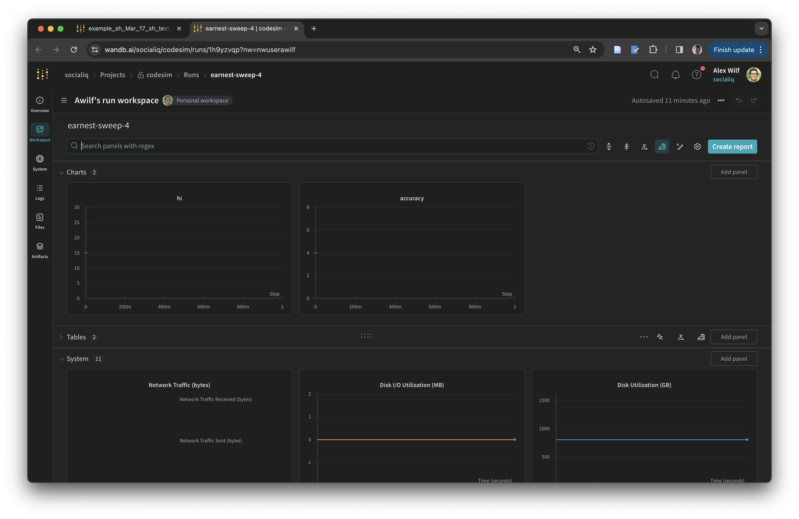

# How I Run Experiments

Note: you should replace all instances of `taro` with your development machine, `awilf` with your username, and `atlas` with your deployment machine / cluster.

## Environments: Singularity
Before we talk about experimental infrastructure, let's talk about how we set up and transfer environments. I work on a development machine called `taro`, where I use `conda` to install packages into environments. To transfer to a remote machine (or cluster), like `atlas`, here's what I do:
1. Create a *single* singularity container that mimics my local OS and low-level binaries such as cuda and cudnn (only need to do this once)
2. Create a conda environment locally
3. Getting conda running in singularity locally, accessing the conda environment files *by reference*
4. Transfer everything to atlas, get it running there the same way.

This has nice properties: I don't have to create different containers for each project (these can be very large, because they contain the whole OS), and whenever I need to update my environments, I can just sync those files over instead of a whole container.

Let's dive into how to do this with an example.
### 1. Creating a singularity container
Let's create the singularity container on your **development machine**. The `.def` file I use is in `base_img.def`, reproduced below. **You may need to update this** to match the OS and cuda used on your dev machine.
```
Bootstrap: docker
From: nvidia/cuda:11.8.0-cudnn8-devel-ubuntu20.04
```

To build the container, simply run this command:
```bash
sudo singularity build base_img.sif base_img.def
```

Great, now let's sync this over to atlas so we have it there too for the future.
```bash
rsync -av base_img.sif awilf@atlas:/work/awilf
```

A quick note on singularity – it's basically an open source version of docker that a lot of labs use on the cluster. You can use it to run programs, like this:

```bash
$ singularity exec base_img.sif /bin/bash -c 'echo "hi"'
hi
```

### 2. Creating the conda environment
Next, let's make an example environment together, called `example_env`, with only two packages: `torch` and `wandb`. In practice you'll install many more packages, but this is a good starting place.

```bash
conda create -n example_env python=3.9 -y && conda activate example_env
pip install torch wandb
```

Let's make sure you can access your GPU. If you can't, you might need to download a different version of torch.
```bash
$ python -c "import torch; print(torch.cuda.is_available())"
True
```

### 3. Getting the conda environment running in the singularity container.
If we were just to run the singularity container and attempt to access the GPU with torch, it would fail.
```bash
$ singularity exec base_img.sif python -c "import torch; print(torch.cuda.is_available())"
FATAL:   "python": executable file not found in $PATH
```

This is because it doesn't have access to the environments. Where are they?
```bash
$ conda info --envs | grep example_env
example_env           *  /work/awilf/anaconda3/envs/example_env
```

Ok cool, so now let's pass those in. The `-B` command binds local paths *by reference* into the singularity container. We'll also pass `--nv`, which passes the low level nvidia drivers from the current machine to the singularity because they're usually not included in the base img. And the final trick we're going to do is write a little script that first activates the conda environment we passed in by reference.

```bash
singularity exec --nv -B /work/awilf/ base_img.sif \
    /bin/bash -c '. /work/awilf/anaconda3/etc/profile.d/conda.sh && conda activate example_env && \
    python -c "import torch; print(torch.cuda.is_available())" \
    '
True
```

As a review, what we just did is quite clever. Instead of creating a different singularity container for each project, we create *one* singularity container that mimics our base OS and low-level binaries, like cuda and cudnn, then we sync that over *once*. Then any time we update environments, we can just sync over the environment files and pass them in by reference. That way, *anything* that works on our local machine from conda should reproduce on atlas instantly. Pretty cool, right?

Next, we'll get this working on atlas.

## Running on Atlas
### Transferring the Files
First, we'll transfer everything over. We need to transfer `base_img.sif`, all of our environment / package files, and the code. I've moved my base img to `/work/awilf/` on my local. This will take a while the first time, but afterwards you'll just need to sync this specific environment and the code, and it will only send files that need to be changed.
```bash
## Transfer base img (only once at beginning)
rsync -av /work/awilf/base_img.sif awilf@atlas:/work/awilf

## Transfer environments (whenever you update)
# NOTE: only do the below step once to transfer some files related to conda's running; after that just run the individual env command below so you don't sync all other envs each time
rsync -av /work/awilf/anaconda3 awilf@atlas:/work/awilf
# TODO: run this every time after this tutorial
# rsync -av /work/awilf/anaconda3/envs/example_env awilf@atlas:/work/awilf/anaconda3/envs 

## Transfer this code repo, e.g. tutorials/experiments
rsync -av /work/awilf/tutorials/experiments awilf@atlas:/work/awilf/tutorials
```

### Running the code
On slurm clusters, there are basically two commands you really care about for deploying resources: `srun` (used interactively, for debugging) and `sbatch` (runs in the background, highly preferred for long running jobs).

Let's allocate ourselves a node to test this on (in a separate tab, ssh into atlas)
```bash
srun -p low --exclude atlas-2-9,atlas-1-13 --gres=gpu:1 --mem=56GB --pty bash
```

Now we can do stuff interactively on this compute node.
```bash
(base) awilf@atlas-1-13:~$
```

We've synced over all the repos and everything, so let's try the same command as above, although this time on atlas.
```bash
$ singularity exec --nv -B /work/awilf/ \
    /work/awilf/base_img.sif \
    /bin/bash -c '. /work/awilf/anaconda3/etc/profile.d/conda.sh && conda activate example_env && \
    python -c "import torch; print(torch.cuda.is_available())" \
    '
INFO:    underlay of /etc/localtime required more than 50 (75) bind mounts
INFO:    underlay of /usr/bin/nvidia-smi required more than 50 (386) bind mounts
True
```

Great! This means we have now successfully replicated our development environment on `atlas`, and can run any command we can run normally there too.

Next we'll see how this becomes powerful in running experiments, but first we need a bit of background on `wandb` sweeps.

## `wandb` Sweeps (Basic)
I'm going to assume you have a basic conceptual knowledge of what wandb sweeps are. If you don't, go read [this](https://github.com/abwilf/tutorials/tree/main/wandb) over -- maybe just skim it, because I'm going to go through a lot of it here too :).

Ok so here's the practical side: you've got a `yml` that defines the programs you want to run, e.g. `./deploy/example_basic.yml`
```yaml
program: example.py
method: grid
parameters:
  _tags: 
    value: some_tag
  arg1: 
    values:
    - 1
    - 2
  arg2:
    values:
      - 2
      - 3
```

This means we want to run the following programs:
```bash
python example.py --arg1 1 --arg2 2
python example.py --arg1 1 --arg2 3
python example.py --arg1 2 --arg2 2
python example.py --arg1 2 --arg2 3
```

How do we do that? First, we let the server know that we want these programs to be run, with
```bash
wandb sweep deploy/example_basic.yml
```

You'll see something like this
```bash
wandb: Creating sweep from: deploy/example_basic.yml
wandb: Creating sweep with ID: yuaqp4s5
wandb: View sweep at: https://wandb.ai/socialiq/tutorials-experiments_deploy/sweeps/yuaqp4s5
wandb: Run sweep agent with: wandb agent socialiq/tutorials-experiments_deploy/yuaqp4s5
```

Now we can run an `agent`, which will receive from the server information about which program to run, and will run it, logging stuff along the way as you choose (see `example.py` for a minimal example)

```bash
wandb agent socialiq/tutorials-experiments_deploy/yuaqp4s5
```

You'll see it starting to run runs
```
wandb: Starting wandb agent 🕵️
2024-03-13 18:06:12,865 - wandb.wandb_agent - INFO - Running runs: []
2024-03-13 18:06:13,095 - wandb.wandb_agent - INFO - Agent received command: run
2024-03-13 18:06:13,096 - wandb.wandb_agent - INFO - Agent starting run with config:
	_tags: some_tag
	arg1: 1
	arg2: 2
2024-03-13 18:06:13,097 - wandb.wandb_agent - INFO - About to run command: /usr/bin/env python example.py --_tags=some_tag --arg1=1 --arg2=2
...
```

The important thing about agents is that you can run as many of them as you like! You can parallelize many different `wandb agent` commands at once. They'll all contact the server, it will give them jobs to do, and they can report back to a centralized place. You can try this: open two tabs, and start two different wandb agents. Then look at the resulting sweep page: you'll see that all the results are logged here.


We can compare these by "grouping by" different values.


There's a lot of cool stuff you can do with this -- we'll keep this tutorial barebones, but if you're curious go look at different wandb tutorials on how you can filter, group, and visualize results. There's also a wandb api where you can pull down results and visualize them yourself.

## Deploying Sweeps (Basic)
Ok you're probably wondering how this connects back to the mission: developing on your development machine, then deploying on `atlas`. The key insight here is that once we define the yml, all we need to do is submit a bunch of jobs with `singularity exec ... wandb agent`, and wandb will parallelize the jobs automatically and aggregate the results across what the agents report. Let's first check in our srun session on `atlas` that this works.

First, create a new sweep on your **dev machine**.
```
$ wandb sweep deploy/example_basic.yml
wandb: Creating sweep from: deploy/example_basic.yml
wandb: Creating sweep with ID: isnebetw
wandb: View sweep at: https://wandb.ai/socialiq/tutorials-experiments_deploy/sweeps/isnebetw
wandb: Run sweep agent with: wandb agent socialiq/tutorials-experiments_deploy/isnebetw
```

Now take the wandb agent command, and let's put it together with singularity to get an agent command that will run on atlas.
```bash
singularity exec --nv --containall --cleanenv --env CUDA_VISIBLE_DEVICES=$CUDA_VISIBLE_DEVICES \
    -B /home/awilf/ \
    -B /work/awilf/ \
    --pwd /work/awilf/tutorials/experiments \
    /work/awilf/base_img.sif \
    /bin/bash -c '. /work/awilf/anaconda3/etc/profile.d/conda.sh && conda activate example_env && \
    wandb agent socialiq/tutorials-experiments_deploy/isnebetw # TODO: modify here
    '\
```

You should see it run successfully. Now exit out of the `srun` session with `exit`. You should only use `srun` with small debugging jobs; when it's time to deploy always use `sbatch`. Let's create a new sweep:
```
wandb: Creating sweep from: deploy/example_basic.yml
wandb: Creating sweep with ID: uif1epbj
wandb: View sweep at: https://wandb.ai/socialiq/tutorials-experiments_deploy/sweeps/uif1epbj
wandb: Run sweep agent with: wandb agent socialiq/tutorials-experiments_deploy/uif1epbj
```

And let's create an sbatch file on our dev machine: **modify the "wandb agent" line of `atlas_basic.sbatch` to have your wandb agent command**. It should look like this:

```bash
#!/bin/bash
#SBATCH -p low
#SBATCH --gres=gpu:1
#SBATCH --mem 40GB
#SBATCH --exclude atlas-2-9,atlas-1-13
#SBATCH --time 6-23:00
#SBATCH --chdir=/work/awilf/tutorials/experiments
#SBATCH --output=/work/awilf/logs/%j.out # TODO
#SBATCH --error=/work/awilf/logs/%j.err # TODO

mkdir -p /work/awilf/logs

singularity exec --nv --containall --cleanenv --env CUDA_VISIBLE_DEVICES=$CUDA_VISIBLE_DEVICES \
    -B /home/awilf/ \
    -B /work/awilf/ \
    --pwd /work/awilf/tutorials/experiments \
    /work/awilf/base_img.sif \
    /bin/bash -c '. /work/awilf/anaconda3/etc/profile.d/conda.sh && conda activate example_env && \
    wandb agent socialiq/tutorials-experiments_deploy/uif1epbj # TODO: modify here
    '\
```

Now sync this over to atlas
```bash
rsync -av /work/awilf/tutorials/experiments awilf@atlas:/work/awilf/tutorials
```

Now in the `atlas` login node, we'll "submit" a few agent commands for this job.
```bash
(base) awilf@atlas-login:~$ sbatch /work/awilf/tutorials/experiments/deploy/atlas_basic.sbatch
Submitted batch job 77274
(base) awilf@atlas-login:~$ sbatch /work/awilf/tutorials/experiments/deploy/atlas_basic.sbatch
Submitted batch job 77275
```

These sbatches are just like sruns, except they're running in the background. You can check to see which runs you have going on atlas with `squeue | grep awilf` and you can check their log files in
```bash
cat /work/awilf/logs/77274.err # replace with your id
```

A minute later, if you go to the sweeps page, you'll see that this successfully concluded


So that's it! Now you know how to create environments, create singularity containers, port everything over to atlas, write code compatible with wandb, create sweeps, and run them in singularity containers so you can easily distribute your experiments across a cluster (or multiple clusters simultaneously).

All that said, it was kind of a pain, right? The beginning part is unavoidable or easy: setting up the environments, writing code compatible with wandb...etc. But the last part was really annoying: creating sweeps, copy and pasting ids, editing sbatch files, running rsync over and over again. Imagine what a headache this will be when you want to launch an experiment – lots of room to make mistakes, too. Not fun. In the next section, I've written a script that will automate this.

## Deploy Sweeps
The above process is pretty efficient, but it has some pain points. Let's review what you did above
1. Create environments, write code compatible with wandb (easy)
2. Create a wandb sweep file (easy, but it's annoying to write "value" and values" all over the place)
3. Potentially create multiple sweep files, one for each experiment you want to run
4. Run the "wandb sweep" command
5. Get the agent name and put it into an sbatch file
6. Sync everything to the server
7. If you want to run this with multiple different servers, you have to do some steps again.
8. Submit the sbatch commands on the server.


I wrote a little script in `deploy/deploy_sweeps.py` that makes 2 and 3 more efficient, and automates 4-7.

Here's how you use it
1. **The program** is the same: you just need a `_tags` argument, a `wandb.init()` and a `wandb.log()` call. e.g.,

**`example.py`**
```python
import wandb
import argparse
parser = argparse.ArgumentParser()
parser.add_argument("--_tags", type=str, default="delete_test")
parser.add_argument("--arg1", type=int, default=0)
parser.add_argument("--arg2", type=int, default=0)
args = parser.parse_args()

wandb.init(
    project="delete_test",
    entity="awilf",
    tags=args._tags.split(',')
)
# Do stuff here
wandb.log({'accuracy': args.arg1+args.arg2})
```

2. **The sweep yml file** is a bit different, see `example.yml`, reproduced below. You don't need "value" or "values" anymore – those were annoying. And if you want to have a single yml specify multiple experiments, you can do that.

```yaml
program: example.py
method: grid
parameters:
  arg1: 1 # this will be inherited by all subtests, but can be overwritten

  subtests:
    hi,there: # will create a sweep with these tags
      arg2:
        - 2
        - 3
    
    hey: # will create another sweep with this tag
      arg1: # will override arg1 for this sweep
        - 3
      arg2:
        - 3
        - 4
```

This will create two sweeps, one with arg1=1, arg2=(2,3), and the other with arg1=3,arg2=(3,4).

3. **The deploy_sweeps script**: check out `deploy/deploy_sweeps.py`, and modify the section with the `TODO`.

```python
sweep_params = {
    'entity': 'socialiq',
    'project': 'codesim',
}
sbatch_files = {
    'atlas': './deploy/atlas.sbatch',
    'babel': './deploy/babel.sbatch' # if you have another server: you'll see it's pretty similar but I have to bind paths differently
}
data_paths = {
    'atlas': '/work',
    'babel': '/home',
}
rsync_cmd = '''
rsync -av /work/awilf/tutorials/experiments awilf@{server}:{data_path}/awilf/tutorials
rsync -av /work/awilf/anaconda3/envs/example_env awilf@{server}:{data_path}/awilf/anaconda3/envs
'''
output_file='./deploy/tower.txt' # where std output is written so you can easily copy and paste sbatch commands and links
```

Then all you do is run
```bash
python deploy/deploy_sweeps.py <yml_name> <server_name>
```

e.g.,
```bash
python deploy/deploy_sweeps.py example.yml atlas
```

You'll see an output like this, also written to `deploy/tower.txt` so you can easily copy and paste sbatch commands and urls :)
```
--- Agent Commands ---
wandb agent socialiq/codesim/25uzlxku
wandb agent socialiq/codesim/7pd18uw3

--- Sweep URLs ---
https://wandb.ai/socialiq/codesim/sweeps/25uzlxku
https://wandb.ai/socialiq/codesim/sweeps/7pd18uw3

--- atlas ---
sbatch /work/awilf/tutorials/experiments/deploy/sbatches/example_Mar_13_hi,there_8d30_atlas.sbatch
sbatch /work/awilf/tutorials/experiments/deploy/sbatches/example_Mar_13_hey_d6b5_atlas.sbatch

Writing to ./deploy/tower.txt...

--- Syncing to atlas... ---
Syncing to atlas -
rsync -av /work/awilf/tutorials/experiments awilf@atlas:/work/awilf/tutorials
rsync -av /work/awilf/anaconda3/envs/example_env awilf@atlas:/work/awilf/anaconda3/envs

Syncing to atlas ✓
```

This has created the sweep, substituted the new agent command for the one in `atlas.sbatch` and put it in a new sbatch file, and synced everything to atlas. All you have to do now is go on atlas and paste these however many times you'd like (for parallelization). 
```bash
sbatch /work/awilf/tutorials/experiments/deploy/sbatches/example_Mar_13_hi,there_8d30_atlas.sbatch
sbatch /work/awilf/tutorials/experiments/deploy/sbatches/example_Mar_13_hey_d6b5_atlas.sbatch
```

Then head over to the sweeps page and you'll see the results start to roll in.


So, **tl;dr**:
1. Get the environments and singularity containers working as described above (once)
2. Create a sweep file in deploy/{name}.yml (once, but you'll modify it as you have new experiments to run)
3. Modify `deploy_sweeps.py` with the information relevant for you (once)
4. Run `python deploy/deploy_sweeps.py name atlas` to create the sweeps and sync everything (each time you experiment)
5. Submit the sbatches in atlas
6. Watch the results come in :)

### "But wait! My program is a shell script, or some non-standard python script!"
No problem. You can run wandb sweep with a shell script instead, and do whatever you'd like in there – even call multiple python program, each with wandb.log() (because wandb logs the run names and sweep ids).

Check it out: imagine we have two python files now that we want to run, `example.py` and `example2.py`. And we want to run a script like this: `script.sh`.

**example.py**
```python
import wandb
import argparse
parser = argparse.ArgumentParser()
parser.add_argument("--_tags", type=str, default="delete_test")
parser.add_argument("--arg1", type=int, default=0)
parser.add_argument("--arg2", type=int, default=0)
args = parser.parse_args()

wandb.init(
    project="delete_test",
    entity="awilf",
    tags=args._tags.split(',')
)

# Do stuff here
wandb.log({'accuracy': args.arg1+args.arg2})
```

**example2.py**
```python
import wandb
import argparse
parser = argparse.ArgumentParser()
parser.add_argument("--_tags", type=str, default="delete_test")
parser.add_argument("--arg2", type=int, default=0)
parser.add_argument("--arg3", type=int, default=0)
args = parser.parse_args()

wandb.init(
    project="delete_test",
    entity="awilf",
    tags=args._tags.split(',')
)

# Do stuff here
wandb.log({'hi': args.arg2*args.arg3})
```

**script.sh**: want it to be something like this
```bash
## Bookkeeping to process the args in the way we want them (omitted, see the actual file for details)
...

##  activate conda
. /work/awilf/anaconda3/etc/profile.d/conda.sh
conda activate example_env

## run the commands
cmd="python example.py --arg1 ${args[arg1]} --arg2 ${args[arg2]}"
echo "$cmd"
eval "$cmd"


cmd2="python example2.py --arg2 ${args[arg2]} --arg3 ${args[arg3]}"
echo "$cmd2"
eval "$cmd2"
```

Then we can just create a sweep yml file that also defines the "command" used to run, instead of just a program. See docs on that [here](https://docs.wandb.ai/guides/sweeps/define-sweep-configuration#command-example).

**example_sh.yml**
```yml
command: 
  - bash
  - script.sh
  - ${args}
method: grid
parameters:
  arg1: 
    - 1
  arg2: 
    - 2
    - 3
  _tags: some_tag
  subtests:
    sh_test:
      arg3:
        - 4
        - 5
```

Then we can run `deploy_sweeps.py` like usual
```bash
$ p deploy/deploy_sweeps.py example_sh atlas
--- Agent Commands ---
wandb agent socialiq/codesim/02slqx4r

--- Sweep URLs ---
https://wandb.ai/socialiq/codesim/sweeps/02slqx4r

--- atlas ---
sbatch /work/awilf/tutorials/experiments/deploy/sbatches/example_sh_Mar_17_sh_test_b923_atlas.sbatch
```

Then we can run the agent command, and we'll see this nice output in the sweep link. Basically, wandb treats each "run" as each run of the *script*, so both python programs are run as part of that single "run", meaning their logs are nicely grouped by run, even though they're separate programs. So in each single run, you can see both "hi" and "accuracy" being logged, even though they were logged from two different python programs, run in sequence. e.g.,


Then for the full sweep, we see that both example and example2 log their respective outputs for each run and we can do all our nice visualizations...etc.


Pretty cool, right? You might not use this feature much, but it's helpful to know how to call the script instead of just a python program – especially b/c when you're reproducing, often times people will have pipelines of multiple programs running in sequence you'll need to stack together. I used to try to modify their code to make these into single python programs, but this is way easier.

