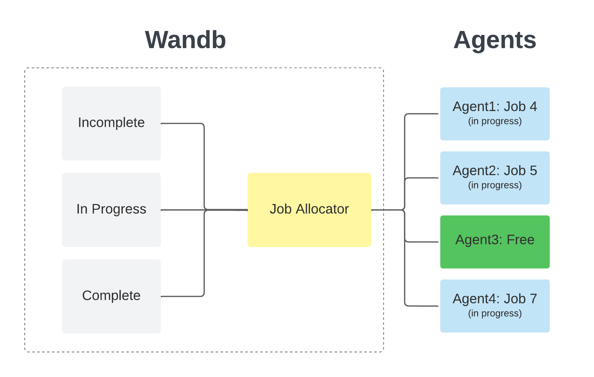
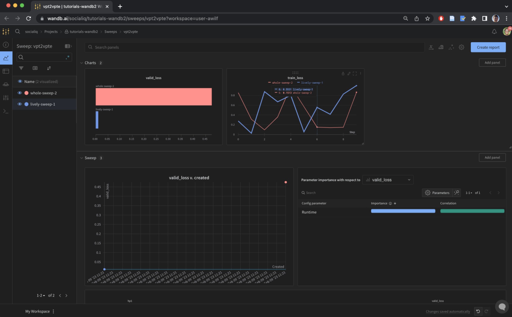
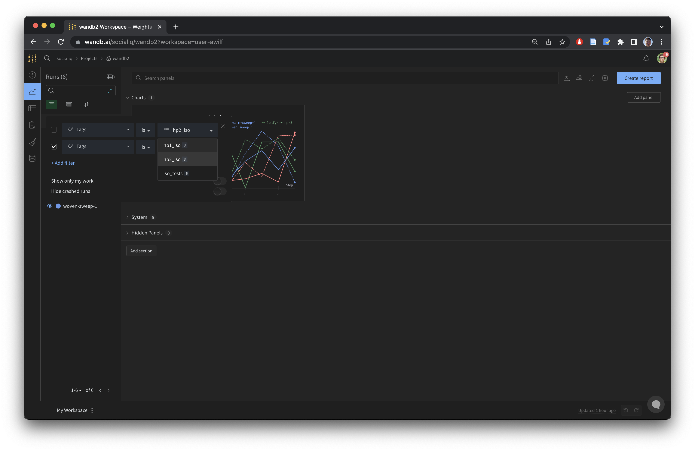
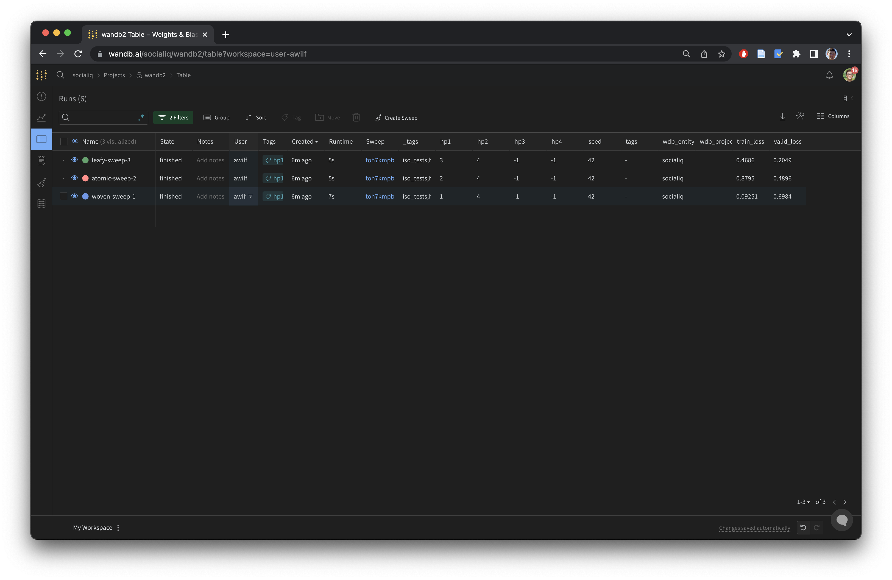
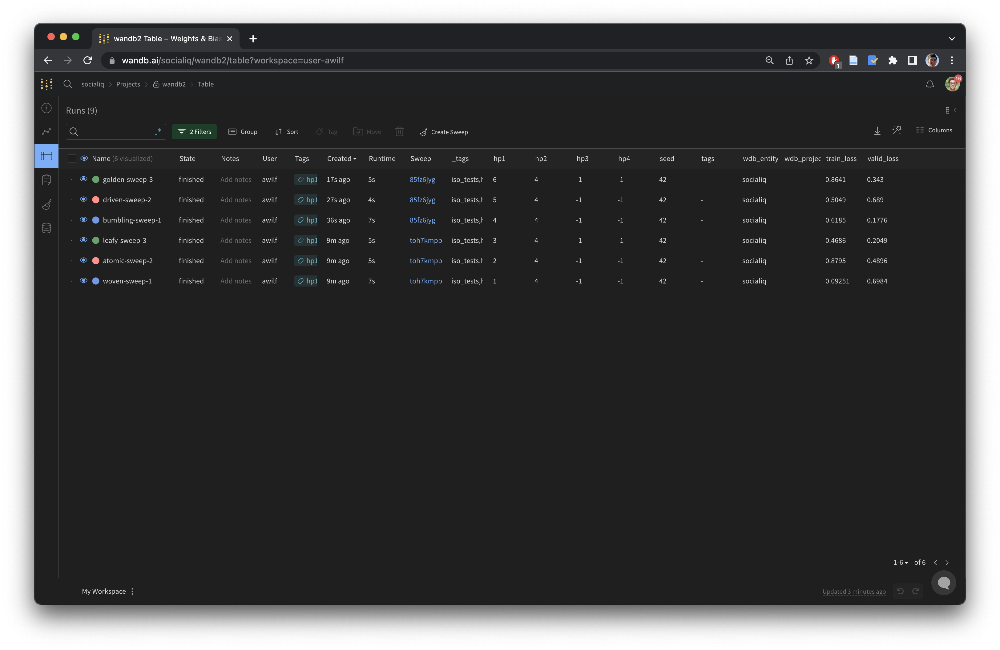

# wandb Sweeps Tutorial

## TL;DR
- Learn what wandb sweeps are and what they can be used for
- Get started with a simple example
- Automate the process with `deploy_sweeps.py`
- Scale your sweep capabilities to multi-sweep and continued sweep configs

To get started with this wandb functionality to your repository, simply copy these files over, modify them, then use deploy sweeps
```bash
# git commit ...etc
cp /work/awilf/tutorials/wandb/*.py ./ && cp /work/awilf/tutorials/wandb/composite_grid.yml ./ && cp /work/awilf/tutorials/wandb/base.sbatch ./
# modify .sbatch, .yml files as needed
p deploy_sweeps.py --c composite_grid.yml # for example
```
## How Does wandb Work and Why Do We Care?
Imagine you want to run all combinations of two hyperparameters: `hp1` and `hp2`, where `hp1` can take on the values `1,2,3` and `hp2` can take on the values `4,5,6`. You need to run `9` programs in total. Or you have nine jobs you'd like to be run by some program, with ids `1...9`. How do you distribute the work?

The idea of a wandb sweep is that you 
1. **Define the sweep** using a yaml configuration file – this is how wandb will know what to search over (e.g. `hp1=1,hp2=4; hp1=1,hp2=5; ...` or `id=1;id=2...`)
2. **Initiate the sweep** by running `wandb sweep config.yml`. This tells wandb to be ready, because you'll be sending it machines to do work soon.
3. **Run the sweep** For each machine you have (or each process within a machine), you run an `agent` command on it. This calls wandb and asks "Do you have anything you'd like me to do?" wandb looks at the jobs in the sweep that javen't been run yet and sends the agent a command to run (e.g. if `id`'s `1` and `2` are being worked on or already complete, it will send out the command `python my_program --id 3`). wandb then removes the job from the "incomplete queue" and puts it in the "in progress queue". When the agent is done, it tells wandb, which then gives it another job from the queue to do. You can do this with as many agents as you want, each calling wandb and wandb sending back what each agent should do by looking at its "Incomplete", "In Progress", and "Complete" queues. When every program in the sweep has been run, wandb kills the `agent` command and releases the machines back into the wild. This is outlined below.



The outputs of programs are logged in wandb using `wandb.log` (used usually for updating graphs as new datapoints come in) and `wandb.summary` (used for high level metrics like `validation_loss`). For an example, see `main.py`.

Two common use cases of sweeps are:
- **You want to search lots of hyperparameter combinations and find the best performing model** on some metric (e.g. `validation_loss`). Easy. Initialize the sweep, run the `agent` command on a bunch of different nodes (e.g. using `sbatch` on Atlas), and watch the results roll in on your wandb dashboard online.
- **You want to distribute some process across many nodes, writing the output to files in a shared file system**. Also easy. Say you wanted to process videos into features using `python process_feats.py --in_video <video_id>.mp4` which writes to `<video_id>.feat`. Your "grid search" would be over a single parameter, where all the possible values of this parameter are all of your video ids. Initialize the sweep, start up a bunch of agent commands, and let wandb and the agents do the rest.

A note before we continue: sweeps can perform multiple kinds of searches. In this tutorial, we'll only consider grid searches.  For more information about Bayesian Optimization and other types of sweeps, check out [wandb's official tutorial](https://docs.wandb.ai/guides/sweeps/quickstart).

We care about this because managing distributed systems is really annoying and error-prone. wandb automates the process beautifully with a super simple API. Try out the examples below and I don't think you'll want to go back :)

## Before We Get Started
- If you're planning to distribute your tests to Atlas and you want to transfer your environment from a development machine, I would first recommend reading my [tutorial on transferring dependencies using Singularity](https://github.com/abwilf/tutorials/blob/main/Atlas_Singularity.md) and get your singularity container set up now for use later in this tutorial.
- Create a wandb account (with your @andrew email it's free) and create an "entity" within it. I called my entity `socialiq`.
- Download the `alex_utils.py` file from [here](https://github.com/abwilf/utils/blob/main/alex_utils.py).
- Create an environment and install dependencies for the tutorial and from the `alex_utils.py` file above.
```
conda create -n wdb_tutorial python=3.7 -y && conda activate wdb_tutorial
pip install --no-cache-dir wandb pyyaml <and dependences from alex_utils.py>
```

## How to Use Sweeps? A Simple Example

The files in this example are included in the repo and reproduced in this `README`.

1. Define the sweep in a `yml` file

**`simple_grid.yml`**
```yaml
program: main.py
method: grid
parameters:
  hp1:
    values:
    - 1
    - 2
    - 3
  hp2:
    values:
    - 4
    - 5
    - 6
  seed:
    value: 42
  wdb_entity:
    value: socialiq
  tags:
    value: test
```

2. Create the sweep
```
wandb sweep simple_grid.yml
```

You'll see an output like this
```bash
wandb: Creating sweep from: simple_grid.yml
wandb: Created sweep with ID: ldexfjng
wandb: View sweep at: https://wandb.ai/socialiq/tutorials-wandb2/sweeps/ldexfjng
wandb: Run sweep agent with: wandb agent socialiq/tutorials-wandb2/ldexfjng
```
3. Run the `agent` command in the terminal and click on the link to take you to the dashboard. 
4. (Or, if you're working on Atlas): run this agent command by taking out a resource using `srun`. If it's a longer job, it's best to do this using `sbatch`. Check out the `#TODO` section below to activate your environment in `sbatch` calls, and don't forget to replace `<your_email>` and `<your_current_dir>`.

**`base.sbatch`**
```
#!/bin/bash
#SBATCH -p gpu_long
#SBATCH --gres=gpu:1
#SBATCH --cpus-per-task=4
#SBATCH --mem 25GB
#SBATCH --mail-type=ALL
#SBATCH --mail-user=<your_email>@gmail.com # TODO
#SBATCH --chdir=<your_current_dir> # TODO
#SBATCH --output=<your_current_dir>/logs/%j.out # TODO
#SBATCH --error=<your_current_dir>/logs/%j.err # TODO

mkdir -p logs

# TODO: activate your environment here
# singularity exec -B /work/awilf/ --nv /work/awilf/AANG/my_env.sif \
# conda activate env
wandb agent <agent_id> # e.g. wandb agent socialiq/meta_synthetic/zky0hiry
```

Then run `sbatch base.sbatch` to submit the job to the queue, and run `squeue | grep andrewid` to see your active jobs. If you're having trouble, you can check the logs using `cat <your_current_dir>/logs/%j.out` where the job id is found in squeue.  I usually first do this using `srun` to make sure I can run with the environment / singularity container, then deploy using `sbatch`.

6. Click ``add a panel``, ``bar chart``, then select ``valid_loss`` as the metric. Now you can see the performances you've logged for each run, as well as the summary plot.  Should look something like this. 



Congratulations! You've made your first sweep. Now you can easily distribute for either of the use cases described above. For hyperparameter searches, include all of the hyperparameters you want to search over. For processing, include the ids you want to process and make sure your program writes to some files you can access later. You can do lots of nice things with this interface, including making reports and lots of cool graphs. wandb can also track gradients of your models, which can be very helpful.

## `deploy_sweeps.py`: A Slightly More Complex (But Powerful) Way to Sweep
### Motivation
Imagine you update your program often and want to run lots of tests. How can we optimize this process? Let's first think about what we did above. If you're working on a development machine and syncing over to Atlas, you need to:
1. Create / modify a config file to defines the sweep
2. Initiate the sweep (e.g. `wandb sweep config.yml`)
3. Create an sbatch file with the resulting `wandb agent socialiq/...` command
4. `rsync` all of these files over to atlas
5. Submit the sbatches on atlas using `sbatch <test_name>.sbatch`, one for each node we want to parallelize across
6. Note the url that defines the sweep, check it to make sure it's working

### Desiderata
This is tedious and error-prone.  It's also limited. What if you want to run multiple different sweeps? You need to manage different config files and different sweep pages on wandb to visualize. I'd prefer for that this whole process
1. be automated
2. enable me to run multiple experiments from a single config file and visualize the results all in a shared dashboard

### Single Sweep Example
In `main.py` I've written a simple template to create a run that takes arguments `hp[1...4]`. Now let's say we want to run the same example as above, `simple_grid.yml`, but automate the process. we only need to make a simple change: adding `subtests` to the parameters section.
**`simple_grid_plus.yml`**
```yaml
program: main.py
method: grid
parameters:
  subtests:
    tag_name1,tag_name2:
      hp1:
        values:
        - 1
        - 2
        - 3
      hp2:
        values:
        - 4
        - 5
        - 6
      seed:
        value: 42
      wdb_entity:
        value: socialiq
      tags:
        value: test
```

Then, we run `deploy_sweeps.py`
```
p deploy_sweeps.py --c simple_grid.yml
```

This script does the following:
1. Initializes the sweep (`wandb sweep ...`) and prints sweep id and url.  Adds these tags to all the runs in the sweep so they can be filtered on in the dashboard.
2. Creates a new `sbatch` file with name `<config_name>.sbatch` by replacing the last `wandb agent` line in `base.sbatch` with the `wandb agent` line from this sweep
4. Runs rsync command (you can put whatever you like here so code and data are synced over to Atlas each time)
5. Prints the `sbatch` command to deploy on Atlas. Just copy and paste this into Atlas as many times as nodes you want to distribute across.
6. Tells you the number of total runs in the sweep, as well as the total anticipated amount of compute time required (you can add `--test_time x` to tell the script that each run takes `x` hours on a single machine)

The output looks like this
```
num runs: 9
total gpu hours: 9
https://wandb.ai/socialiq/wandb2/sweeps/sk58qom2

sbatch /work/awilf/tutorials/wandb2/simple_grid_plus_tag_name1,tag_name2_0.sbatch
wandb agent socialiq/wandb2/sk58qom2
```

You can then run the `wandb agent` command on your local machine, or submit the sbatch scripts to atlas by copy and pasting the `sbatch` line, or both.


### Multiple Sweep Example
Now for the cherry on top: we'd like to be able to run multiple different experiments, all from a single composite config file. `deploy_sweeps` is built for just this. Just add different subsections within subtests, each with the tags that you'd like to define the sweeps.  In the example below, I've decided instead of doing a single sweep over both `hp`'s' I'd just like to isolate hyperparameter 1 and run a bunch of tests on that. I label it with `iso_tests` and `hp1_iso` tags, and do the same with `hp2`. This program will run two sweeps, one for each subtest, and will add tags that will help us filter based on those tests later.

**`composite_grid.yml`**
```yaml
program: main.py
method: grid
parameters:
  # all shared parameters here
  seed:
    value: 42
  wdb_entity:
    value: socialiq
  tags:
    value: test
  
  # all subtest parameters here  
  subtests:
    iso_tests,hp1_iso:
      hp1:
        values:
        - 1
        - 2
        - 3
      hp2:
        value: 4
      
    iso_tests,hp2_iso:
      hp1:
        value: 1
      hp2:
        values:
        - 4
        - 5
        - 6
```

We rerun `deploy_sweeps`
```
$ p deploy_sweeps.py --c composite_grid.yml
```

And the output is as we expect: two different sweeps, each with their own `agent` and `sbatch` comments.
```
num runs: 6
total gpu hours: 6
https://wandb.ai/socialiq/wandb2/sweeps/hkzwf9bn
https://wandb.ai/socialiq/wandb2/sweeps/2ul3itzt

sbatch /work/awilf/tutorials/wandb2/composite_grid_iso_tests,hp1_iso_0.sbatch
sbatch /work/awilf/tutorials/wandb2/composite_grid_iso_tests,hp2_iso_0.sbatch
wandb agent socialiq/wandb2/hkzwf9bn
wandb agent socialiq/wandb2/2ul3itzt
```

After running both `agent` commands, we see that the dashboard has all of our runs, filterable by the wandb Tags attribute.

We can filter to `hp1_iso` tests, for example, and view our results as a table.

One nice outcome of this way of structuring experiments is that **if you want to continue your search**, instead of being locked into different sweeps which are hard to organize, you can just continue to expand the search space, using the same tags as before. For example, if we wanted to expand on the `hp1_iso` tests, we could just comment out the tests we've already run and add some more.

**`composite_continued.yml`**
```yaml
program: main.py
method: grid
parameters:
  # all shared parameters here
  seed:
    value: 42
  wdb_entity:
    value: socialiq
  
  # all subtest parameters here  
  subtests:
    iso_tests,hp1_iso:
      hp1:
        values:
        # - 1
        # - 2
        # - 3
        - 4
        - 5
        - 6
      hp2:
        value: 4
```

Then after running `p deploy_sweeps.py --c composite_continued.yml` and the resulting agent commands again, we see that our dashboard has update to include all the tests.



If you need to programatically interact with your wandb runs, check out `clean_wdb.py` and `modify_runs.py`. You can extract data or modify runs depending on the tags or other aspects you'd like to filter on.

## My Testing Workflow
A final note, on my testing workflow. You can use this as a starting point for your own workflow, if you'd like. 

### During the Day

1. Review the results from the day before on wandb. 
  a. Add results to a report in a panel grid. In the heading of that section, include date and tag name of this test. 
  b. Come up with a hypothesis I want to test next.
  c. Commit current code (using tag name).
2. Create test with new tag name + `dev_tests` in the `subtests` portion of my `yml` file, e.g.
```yaml
program: my_program.py
method: grid
parameters:
  seed:
    value: 42
  # more stable variables here...
  subtests:
    this_test_name,dev_tests:
      variable_to_test:
        values:
        - 1
        - 2
        - 3
```
3. Write little tests, get working as I expect on my local machine. When I've finished development testing, I use `clean_wdb.py` with `dev_test` tag. Now I'm ready to deploy.
5. Deploy tests. This happens at least an hour before I leave for the day, because I want to make sure nothing's crashed or gone wrong.
6. Write down notes for yourself what to look for in this test tomorrow. e.g.
> Testing `variable_to_test`. Hypothesis: higher values will lead to longer convergence time...etc. If so, test __ next. If not, test __ then __ next. Visualize with convergence plots filtered to tag `this_test_name` and grouped by `variable_to_test`.
7. Before you go: make sure results make sense as they come in.

### Next Morning


That's all for now! Please let me know if you have any questions. It takes a bit of work to get this system up and running, but hopefully it is very worth your while. I know it has been for me.
